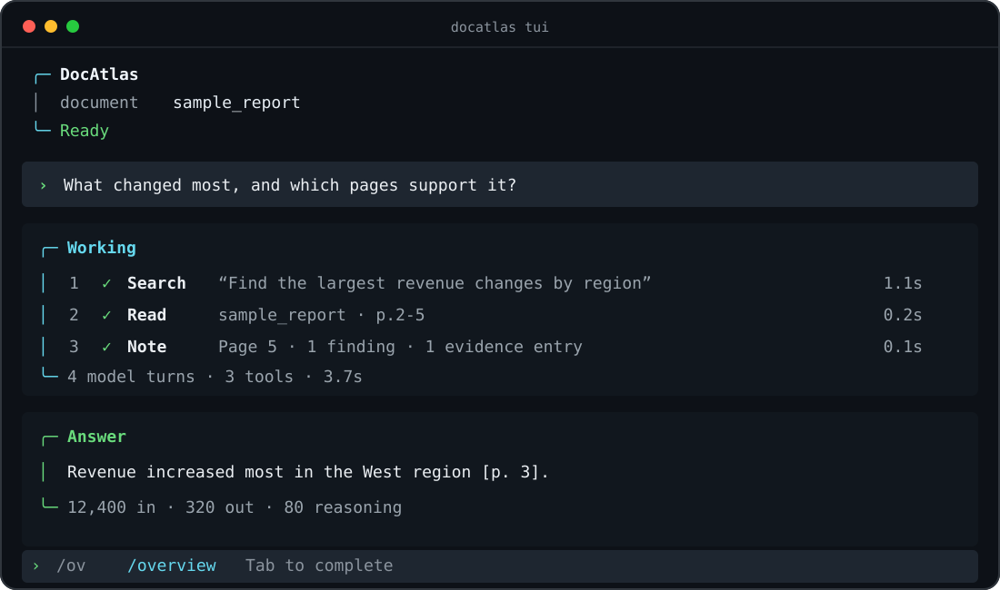
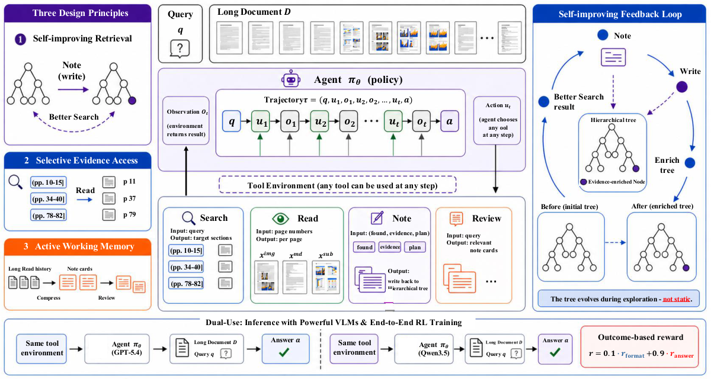

# DocAtlas: Long-Document Understanding as Mutable-State Interaction

<p align="center">
  <strong>An open-source agent harness for evidence-grounded reasoning over long, multimodal documents.</strong>
</p>

<p align="center">
  <a href="https://officeintelligence.github.io/docatlas/"></a>
  <a href="https://arxiv.org/abs/2608.07527"></a>
  <a href="https://github.com/microsoft/DocAtlas-Harness/actions/workflows/ci.yml"></a>
  <a href="https://github.com/microsoft/DocAtlas-Harness/actions/workflows/codeql.yml"></a>
  <a href="https://opensource.org/license/mit"></a>
  
  <a href="https://agentskills.io/"></a>
  <a href="https://officeintelligence.github.io/xl-docbench/"></a>
</p>

<p align="center">
  <a href="https://officeintelligence.github.io/docatlas/"><b>Project page</b></a>
  · <a href="https://arxiv.org/abs/2608.07527"><b>Paper</b></a>
  · <a href="#-interactive-tui"><b>Interactive TUI</b></a>
  · <a href="#-results-and-leaderboard"><b>Leaderboard</b></a>
  · <a href="https://officeintelligence.github.io/xl-docbench/"><b>XL-DocBench</b></a>
  · <a href="ARCHITECTURE.md"><b>Architecture</b></a>
</p>

DocAtlas turns a PDF collection into a mutable workspace. An agent can search
the document tree, read selected text and images, record page-grounded
findings, and recall those findings later. Evidence gathered in one step
changes what subsequent steps can retrieve.

> **The document is not a frozen index. It becomes state the agent can improve
> while it works.**

## ✨ Interactive TUI

<p align="center">
  <a href="assets/tui-preview.svg">
    
  </a>
</p>

<p align="center"><sub>Select local or remote PDFs, ask follow-up questions, inspect tool calls, and review the evolving evidence state without leaving the terminal.</sub></p>

### Start locally

Install [uv](https://docs.astral.sh/uv/), then:

```bash
git clone https://github.com/microsoft/DocAtlas-Harness.git
cd DocAtlas-Harness
uv sync --locked
cp .env.example .env                 # fill in your Azure deployment
az login                              # omit when using AZURE_OPENAI_API_KEY
bash scripts/start_tui.sh
```

API-key authentication is also supported: set `AZURE_OPENAI_API_KEY` in
`.env` and omit `az login`. The first environment sync can occupy roughly 5 GB
on Linux because Docling brings Torch and platform acceleration libraries. The
first local Markdown build downloads approximately 2 GB of layout models.

### Select documents and start asking

| Start with | Example |
|---|---|
| Interactive picker | `bash scripts/start_tui.sh`, then press <kbd>@</kbd> |
| One PDF | `bash scripts/start_tui.sh @report.pdf` |
| Multiple PDFs | `bash scripts/start_tui.sh @report.pdf @appendix.pdf` |
| A folder | `bash scripts/start_tui.sh @reports/ --recursive` |
| A remote PDF | `bash scripts/start_tui.sh 'https://example.com/report.pdf'` |

The workbench builds or reuses a content-addressed workspace under
`outputs/tui/`, then keeps the same model conversation alive for follow-up
questions. Local selection supports files, multi-select, and whole folders;
HTTP(S) PDF URLs are downloaded into a validated private cache.

| Interaction | What it does |
|---|---|
| <kbd>@</kbd> | Opens the in-place PDF and folder picker. |
| <kbd>/</kbd> | Shows matching commands; keep typing to filter and press <kbd>Tab</kbd> to complete. |
| <kbd>↑</kbd> / <kbd>↓</kbd> | Selects a completion or recalls question history. |
| <kbd>Esc</kbd> | Closes a popup, cancels input, or interrupts the active turn. |
| <kbd>Ctrl</kbd>+<kbd>C</kbd> twice | Cancels once, then exits cleanly within two seconds. |
| <kbd>Ctrl</kbd>+<kbd>L</kbd> | Clears the visible screen and redraws the current draft at the top. |

The main chat stays in the normal terminal buffer, so completed turns remain
available for scrolling and copying. Each chat session starts on a clean
visible page, live output keeps breathing room above the terminal edge, and
the input composer preserves two blank rows below it. Colour follows the
terminal automatically; set `DOCATLAS_THEME=dark`, `light`, or `auto`, or set
`NO_COLOR=1` for an uncoloured interface.

<details>
<summary><b>TUI command reference</b></summary>

| Command | Action |
|---|---|
| `/add <@path\|URL>` | Add PDFs and begin a new document conversation. |
| `/new <@path\|URL>` | Replace the active document set. |
| `/files` | Show active documents. |
| `/overview [view]` | Open Summary, Findings, Outline, or History without calling the model. |
| `/overview export` | Write a private `overview.md` inside the active workspace. |
| `/clear` | Clear conversation history while keeping cached preprocessing. |
| `/rebuild` | Force Markdown and PageIndex regeneration. |
| `/help` | Show commands and keyboard controls. |
| `/quit` | Exit; cached work remains available. |

Inside the <kbd>@</kbd> picker, use <kbd>↑</kbd>/<kbd>↓</kbd> to move,
<kbd>Enter</kbd> to open or select, <kbd>Space</kbd> to mark several PDFs,
<kbd>d</kbd> to finish a multi-selection, and <kbd>f</kbd> to select the
current folder. Press <kbd>←</kbd> to open the parent folder, or press
<kbd>Backspace</kbd>/<kbd>Delete</kbd> to remove the triggering <kbd>@</kbd>
and return to the composer. Selections are capped at 100 PDFs unless
`--max-documents N` is provided.

</details>

## 🧭 Why DocAtlas

<table>
  <tr>
    <td align="center" width="25%"><strong>71.4%</strong><br><sub>MMLongBench-Doc<br>GPT-5.4 + DocAtlas</sub></td>
    <td align="center" width="25%"><strong>63.7%</strong><br><sub>MMLongBench-Doc<br>Qwen3.5-4B + RL</sub></td>
    <td align="center" width="25%"><strong>+20.5</strong><br><sub>FinRAGBench-V gain<br>over GPT-5.4 direct</sub></td>
    <td align="center" width="25%"><strong>4 Skills</strong><br><sub>Search · Read<br>Note · Review</sub></td>
  </tr>
</table>

| Design principle | Why it matters |
|---|---|
| 🌲 **Self-improving retrieval** | Page-grounded findings enrich the session-local tree, so later searches see accumulated evidence instead of a frozen index. |
| 🎯 **Selective multimodal access** | Search proposes candidate regions; Read decides which text, page images, and figure crops enter context. |
| 🧠 **Active working memory** | Structured notes retain source attribution while Review recalls only the findings needed next. |
| 🔎 **Inspectable execution** | Every action is a JSON-over-stdio Skill call with persisted session state and a structured trace. |
| 🧩 **Portable Skills** | Search, Read, Note, and Review follow the Agent Skills metadata and naming conventions. |

### Four composable Skills

|  | Skill | Role |
|:---:|---|---|
| 🔎 | [`search`](docatlas/skills/search/) | Navigate a PageIndex tree and propose relevant document regions. |
| 📖 | [`read`](docatlas/skills/read/) | Return page text, optional page images, and selected figure pixels. |
| 📝 | [`note`](docatlas/skills/note/) | Save findings, plans, and page-anchored evidence into mutable state. |
| 🔁 | [`review`](docatlas/skills/review/) | Retrieve saved notes relevant to a focused query. |

## 🏆 Results and leaderboard

> **GPT-5.4 + DocAtlas reaches 71.4 on MMLongBench-Doc**: +9.0 over
> direct input and +5.6 above the 65.8 human-expert reference. The same setup
> improves GPT-5.4 by +20.5 on FinRAGBench-V and +11.9 on LongDocURL.

<table>
  <tr>
    <td width="33.33%"><a href="https://officeintelligence.github.io/docatlas/assets/figures/motivation-results.png"></a></td>
    <td width="33.33%"><a href="https://officeintelligence.github.io/docatlas/assets/figures/ablation.png"></a></td>
    <td width="33.33%"><a href="https://officeintelligence.github.io/docatlas/assets/figures/tool-calls.png"></a></td>
  </tr>
  <tr>
    <td align="center"><sub>Overall performance across direct, harness, and RL settings</sub></td>
    <td align="center"><sub>Component ablation on MMLongBench-Doc</sub></td>
    <td align="center"><sub>Average tool allocation by policy</sub></td>
  </tr>
</table>

Every component contributes: removing full-page images, figure crops,
decoupled Read, or mutable memory reduces MMLongBench-Doc performance. The tool
allocation plot shows that the policy learns different Search, Read, Note, and
Review budgets rather than following a scripted sequence.

Selected results from the paper are shown below. The
[interactive project leaderboard](https://officeintelligence.github.io/docatlas/#leaderboard)
contains all 27 systems and the complete 14-metric breakdown.

| System | Setting | MMLongBench-Doc Acc. | FinRAGBench-V LasJ | LongDocURL LasJ |
|---|---|---:|---:|---:|
| **DocAtlas + GPT-5.4** | **Harness** | **71.4** 🏆 | **75.6** | **78.8** |
| **DocAtlas + GPT-5.2** | **Harness** | **70.6** | **75.2** | **77.5** |
| DocLens + Gemini-2.5-Pro | Agent framework | 67.6 | 70.4 | — |
| _Human expert_ | _Reference_ | _65.8_ | — | — |
| DocLens + Gemini-2.5-Flash | Agent framework | 64.7 | 68.5 | — |
| DocAtlas RL + Qwen3.5-9B | Trained policy | 64.4 | 72.6 | — |
| DocAtlas RL + Qwen3.5-4B | Trained policy | 63.7 | 71.7 | — |
| GPT-5.4 | Direct input | 62.4 | 55.1 | 66.9 |
| DocAtlas + Qwen3.5-9B | Harness | 61.6 | 69.8 | 74.0 |
| DocAtlas + Qwen3.5-4B | Harness | 61.0 | 67.9 | 72.5 |
| Qwen3.5-4B | Direct input | 54.4 | 52.8 | 52.4 |

<sub>MMLongBench-Doc reports overall accuracy. FinRAGBench-V and LongDocURL
report LLM-as-judge (LasJ). Dashes denote unreported results; RL rows omit
LongDocURL because it is used to construct the RL data. See the paper for
protocols, prompts, confidence intervals, and complete baselines.</sub>

## 🔍 How it works

<p align="center">
  <a href="assets/framework.png">
    
  </a>
</p>

The model operates over a state
`S = (documents, tree, note store, explored pages)` and chooses any Skill at
each step—there is no fixed tool order.

1. **Search the tree.** A question-agnostic hierarchy provides titles, page
   ranges, summaries, and findings accumulated earlier in the session.
2. **Read selectively.** The agent chooses which pages to consume and whether
   it needs text, full-page layout images, or individual figures.
3. **Write evidence back.** Note stores source-attributed findings and annotates
   the finest covering tree node, improving subsequent retrieval.
4. **Review on demand.** Relevant notes return to active context before the
   final evidence-grounded answer is synthesized.

The harness owns execution, multimodal transport, safety limits, trace events,
and atomic session state. See [ARCHITECTURE.md](ARCHITECTURE.md) for the runtime,
Skill, workspace, and trust-boundary contracts.

## 🔬 Complete trajectory

<details>
<summary><b>Open a complete multi-hop evidence trajectory</b></summary>

<br>

<p align="center">
  <a href="https://officeintelligence.github.io/docatlas/assets/figures/trajectory-multihop.png">
    
  </a>
</p>

The trajectory shows Search locating candidate pages, Read extracting the
required values, Note preserving both page citations, and the enriched tree
carrying that evidence into the final answer.

</details>

## ⚙️ CLI and Skill usage

The dependency versions in `uv.lock` are the tested release environment.
`harness` remains available as a compatibility alias, but new integrations
should use the canonical `docatlas` command.

### Run a Skill directly

`read` can run without model credentials or session state:

```bash
uv run --locked python docatlas/skills/read/scripts/run.py \
  --pdf data/sample_report.pdf \
  --pages 1,3
```

Stateful Skills share a session file. Create one before invoking them directly:

```bash
export HARNESS_SESSION_FILE="$(uv run --locked docatlas init-session \
  --pdf document.pdf \
  --tree-json trees/document_structure.json \
  --question 'What are the report conclusions?')"

uv run --locked python docatlas/skills/search/scripts/run.py \
  --query "Locate sections containing the report conclusions."
```

See the [Skills guide](docatlas/skills/README.md) for the complete standalone
contract and examples.

### Run the non-interactive harness

```bash
uv run --locked docatlas chat \
  --skill search --skill read --skill note --skill review \
  --pdf document.pdf \
  --markdown-dir markdown/ \
  --tree-json trees/document_structure.json \
  --message "What are the main conclusions, and which pages support them?"
```

The final answer is written to stdout. Progress, tool calls, token usage, and
the session path are written to stderr, keeping shell pipelines stable. Add
`--format json` for structured integrations, `--show-reasoning` for
API-provided reasoning summaries, or `--quiet` for the final answer only.

### Run the complete sample pipeline

```bash
bash scripts/demo_end_to_end.sh
```

This runs the bundled self-authored sample through Markdown extraction,
PageIndex construction, and the four-Skill chat loop. Completed artifacts are
cached under `outputs/demo/`.

```text
PDF ──► build-md ──► per-page Markdown + figures
   ──► build-tree ──► hierarchical document index
   ──► chat ────────► Search → Read → Note → Review → answer
```

## 📄 Preprocessing and multiple documents

Build the hierarchical tree used by `search`:

```bash
uv run --locked docatlas build-tree \
  --pdf document.pdf \
  --output-dir trees/ \
  --model "$AZURE_OPENAI_DEPLOYMENT"
```

Build per-page Markdown and extracted figures with Docling:

```bash
uv run --locked docatlas build-md \
  --pdf document.pdf \
  --output-dir markdown/
```

The reported experiments use MinerU 2.5 output. Docling is the convenient
local preprocessing path and follows the same per-page directory contract, but
its extraction quality can differ on dense tables, formulas, and complex
layouts.

For questions spanning several PDFs, build a merged tree and pass every PDF to
the harness:

```bash
uv run --locked docatlas build-series-tree \
  --pdf reports/2024.pdf --pdf reports/2025.pdf \
  --output trees/annual_reports.json \
  --doc-name "Annual reports" \
  --model "$AZURE_OPENAI_DEPLOYMENT"

uv run --locked docatlas chat \
  --pdf reports/2024.pdf --pdf reports/2025.pdf \
  --markdown-dir markdown/ \
  --tree-json trees/annual_reports.json \
  --message "Compare the principal risks reported in 2024 and 2025."
```

Use `--manifest` for explicit per-document IDs or Markdown paths.
`scripts/demo_end_to_end_multi.sh` provides a complete example.

## 📂 Repository map

| Path | Purpose |
|---|---|
| `docatlas/agent/` | Multi-turn loop, Skill dispatch, hooks, and trace events. |
| `docatlas/ui/` | Interactive workbench, command completion, overview, and pipe-safe rendering. |
| `docatlas/skills/` | Portable Search, Read, Note, and Review Skills plus their shared runtime. |
| `docatlas/session/` | Atomic session state, document environment, notes, and mutable trees. |
| `docatlas/preprocess/` | PDF-to-Markdown and PageIndex tree construction. |
| `docatlas/benchmarks/` | MMLongBench-Doc evaluation runner. |
| `docatlas/scoring/` | Benchmark answer extraction and scoring. |
| `docatlas/profiles/` | Versioned runtime defaults. |
| `scripts/` | One-command TUI, demos, and evaluation launchers. |
| `tests/` | Unit, integration, PTY, security, and packaging regressions. |

## 🧪 Evaluation and reproducibility

### Related benchmark: XL-DocBench

[**XL-DocBench — Evidence at Scale**](https://officeintelligence.github.io/xl-docbench/)
is our companion, human-verified benchmark for evidence-grounded reasoning
over extra-long professional documents. It contains 1,519 questions, has a
median context of 211 pages, reaches 2,303 pages at maximum, and requires
cross-page evidence for 72.6% of its questions. Visit the
[project homepage](https://officeintelligence.github.io/xl-docbench/) for the
paper, benchmark design, diagnostics, and interactive leaderboard.

Run the MMLongBench-Doc harness and scorer:

```bash
bash scripts/run_eval.sh --limit 20 --n-jobs 4

uv run --locked python -m docatlas.scoring.score_mmlongbench_hybrid \
  --input outputs/mmlongbench_harness_TIMESTAMP.json \
  --model "$AZURE_OPENAI_DEPLOYMENT"
```

Evaluation outputs record the DocAtlas version, Git revision, model deployment,
API version, and `uv.lock` hash. Benchmark corpora are obtained from their
original sources and are not redistributed here; the repository includes a
small self-authored PDF for smoke tests and demos.

## 🧑‍💻 Development

```bash
uv sync --locked --extra dev
uv run --locked pytest
uvx ruff==0.16.5 check .
uvx ruff==0.16.5 format --check .
uv run --locked --with mypy==2.3.1 mypy docatlas
uv build
```

Contributions are welcome; see [CONTRIBUTING.md](CONTRIBUTING.md).

## 📌 Citation

If you use DocAtlas in your research, please cite:

```bibtex
@article{wei2026docatlas,
  title  = {{DocAtlas}: Long-Document Understanding as Mutable-State Interaction},
  author = {Wei, Hongchen and Wang, Yuanzhe and Liu, Bei and Yang, Yifan and
            Dai, Qi and Qiu, Kai and Li, Yunsheng and Chen, Dongdong and
            Luo, Chong and Chen, Zhenzhong and Guo, Baining},
  year   = {2026},
  note   = {Preprint},
  url    = {https://arxiv.org/abs/2608.07527}
}
```

## License and acknowledgements

DocAtlas is released under the [MIT License](LICENSE). The vendored PageIndex
snapshot retains its upstream MIT license and provenance under
[`docatlas/_vendor/pageindex/`](docatlas/_vendor/pageindex/).

DocAtlas builds on PageIndex, MinerU, Docling, verl, and vLLM. We thank their
authors and the creators of MMLongBench-Doc, FinRAGBench-V, and LongDocURL for
releasing their work.
